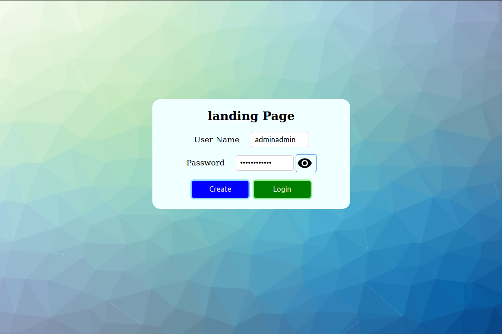
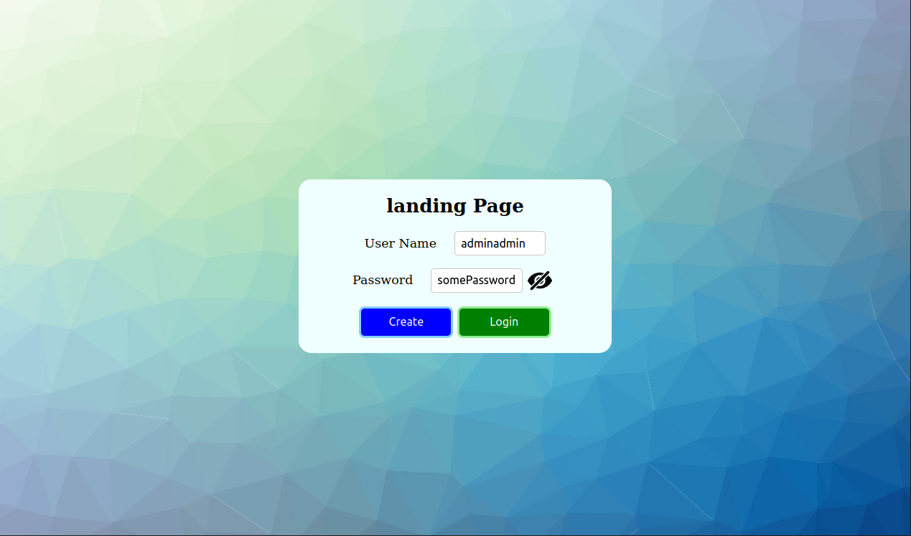

# Landing Page

### This is a simple project skeleton for building a Landing/Login Page for Websites/Web Apps.

This is work in process.
See TO-DO list for scope and features.

### Below Example Image of Look & Layout of Login page

First screenshot shows default look, with hidden password.

Second screenshot shows "Show password" button toggled, with visible password.

---

### *TO-DO Breakdown*

- ~~Password Login Fields~~
- ~~Backend DB Implementing~~ with Encyrption etc
- Process Animation/Feedback
- KeyBased Login ?
- MFA ?

